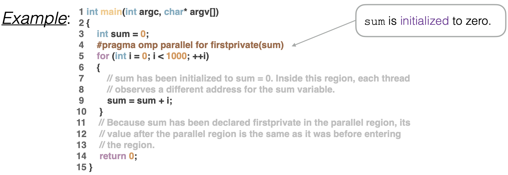
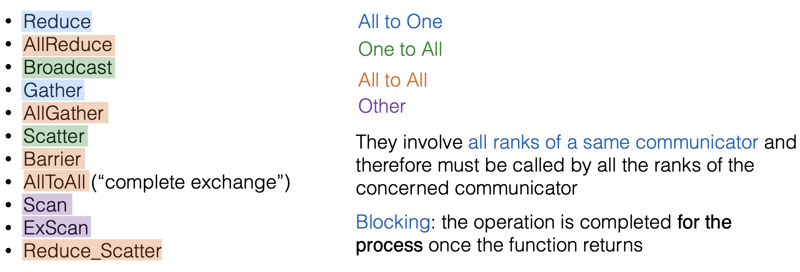
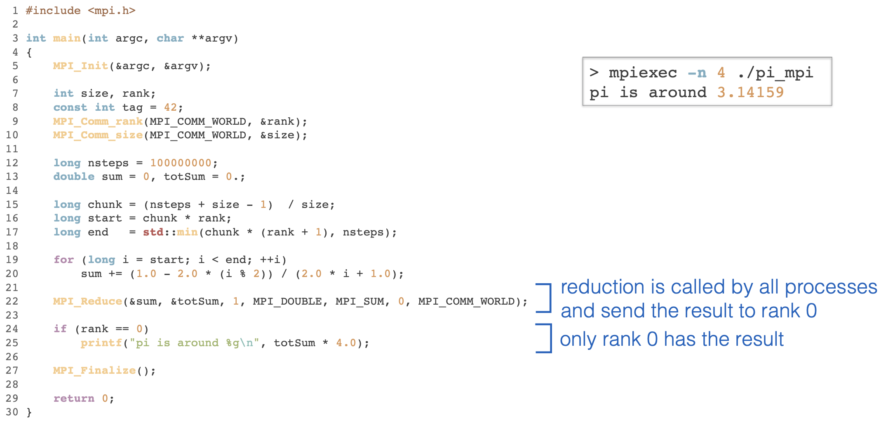
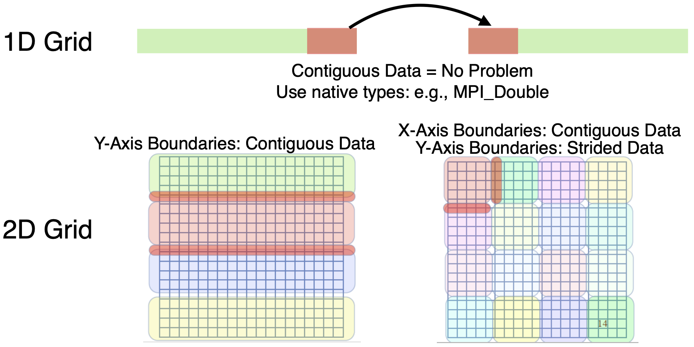

# 1. Theoretical Foundation of HPC for Computational Science and Engineering

​                                      <font size=3>Shizheng Wen         shiwen@student.ethz.ch</font>

**Course Information:** https://www.cse-lab.ethz.ch/teaching/hpcse-i-hs22/

<font size=3>**Table of Content**</font>

[toc]


## Introduction

**Computing:**

- serial computing: serial implementation of programs for single CPUs 

- parallel computing: program is executed using multiple machines

  - A problem is broken into discrete parts that can be solved concurrently.

  - Each part is further broken down to a series of instructions.
  - Instructions from each part execute simultaneously on different machines (here: CPUs).

**Why parallel computing：**

- physical/parctial constraints for even fast serial computers
  - transmissin speeds - the speed of a serial computer is directly dependent upon how fast data case move through hardware.
  - limits to miniaturization - processor technology is allowing an increasing number of transitors to be place on a chip.
- econmics limitations - increasingly expensive to make a single processor fater. using a larger number of moderately fast commodity processors to achive the same performance is less expensive.
- energy limt - limits imposed by cooling needs for chips and supercomputers.

Firstly, people use the single-core processor. However, they found that power wall will happen when continuing to use single-core processor. After hitting the wall, people started to think multi-core processor. Multi-core processor can also help us conduct parallel programming. ==In this definition, a core means a computational unit.==

Therefore, after that, all major processor vendors are producing multicore chips, giving rise to that every machine is already a parallel machine.

**Parallel computing concepts and terminology:**

- Terminology: units of measure
  - Flop: floating point operation, usually double precision unless noted.
  - Flop/s ("flops"): floating point opeartions per second.
  - Bytes: size of data (a double precision floating point number is 8 bytes).

- von Neumann Architecture
  - memory: RAM (radom access memory) stores both program instructions and data
    - program instructions are coded data which tells the computer to do something
    - data is simply information to be used by the program.
  - control units - fetch instructions/data from memory, decodes the instructions and then sequentially coordinates operations to accomplish the programmed task.
  - arithmetic units - perform basic arithmetic operations
  - input/output - is the interface to the human operator
  - 

- Cluster: A set of computers connected over a Local Area Network (LAN) that functions as a single computer with large multiprocessor.

- Multicores, multiprocessors:
  - Multiple processors per chip.  
    • Processors are referred to as cores.    【所以是同一个概念】
      → Number of cores per chip is expected to double per year.  【moole's law】


**Performance evalutions:**

1. Computational cost (energy)

   - Total execution time on all processors:

     - *t(1)*: execution time (wall-clock) on a single proc.

     - $t_i$*(Nproc)*: execution time (wall-clock) on processor *i* out of *Nproc* processors.

     - Cost: Cp(Nproc)=Nproc*$\text{MAX}_{i}$($t_i$(Nproc))

     - Cost-optimal algorithm: cost to solve the problem on Nproc processors is equal to cost to solve it on a single processor.

       Speedup factor:

2. Speedup factor: 

   - How many times faster the problem is solved on *Nproc* processors than on a single processor:
   - Speedup (using j samples):
     - 
     - *N(1)* and *N(Nproc)* are the problem sizes.
     - The maximum speedup is *Nproc* (linear speedup). 
     - Super linear speedup, i.e., *S(Nproc) > Nproc* is an artifact of using a sub-optimal sequential algorithm.

3. Scaling [Reference](http://t.zoukankan.com/fourmi-p-11924451.html)

==Strong scaling 和 weak scaling是高性能计算中我们做分析的一种手段，针对我们尝试解决的不同问题。== [Youtube](https://www.youtube.com/watch?v=539pseJ3EUc)

   - Strong scaling:
- ==run a problem faster (problem doesn't change)==
     - Problem size does not change with the number of processors, so the amount of work per processor decreases with the increase of processors.

   - Weak scaling:
     - ==Run a larger problem (or more) with fixed time==
     - Problem size increases proportionally with the number of processors, so the amount of work per processor remains constant with the increasing number of processors .

   - Strong scaling is harder to achieve because the communication overhead grows.

4. Parallel efficiency:

   - Fraction of the time the processors are being used for computation:

     

   - The efficiency is between 0 and 1 (or 0% and 100%) with an ideal program achieving 100% efficiency.

5. Scalability


6. Amdahl's law:

   - Upper bound for speedup of a given program (fixed-size problem, **strong**

     **scaling**): ==$S_s$ means speed up factor defined in 2==

   - *f*: serial factor, i.e., fraction of the program that cannot be parallelized

     ($t_s$ = serial time):

     

   - Maximum speed with an infinite number of processors (*N*) is *1/f*. If e.g.,

     5% of the program is sequential, the speedup can never exceed 20!

   - Question: what value of *f* is required to obtain a speedup of 90 using 100 cores ?

7. 
   
   - Compared with 2, Amdahl's also discussed the effect of portion of the parallel part in the code to the speed up.
   - Also remember that speed up doesn't mean that your code have high efficiency. 
   
8. Gufstafson’s law (serial part does not grow with problem size): <font color=red> don't understand!</font>

   - Assume the cost(*T*) of parallel execution on *N* processors is *T = 1.*

   - Let *s* denote the serial part and *p* the parallel time, thus: *s + p = 1*.

   - The cost of the serial calculations is: *T’ = s + N\*p*

   - The scaling is then:

     

   - “Any sufficiently large problem scales well”.


References
[1](https://blog.csdn.net/rs_gis/article/details/115860381) [2](https://blog.csdn.net/Cobb141/article/details/106994450?spm=1001.2101.3001.6650.1&utm_medium=distribute.pc_relevant.none-task-blog-2%7Edefault%7ECTRLIST%7ERate-1-106994450-blog-83239493.pc_relevant_multi_platform_whitelistv3&depth_1-utm_source=distribute.pc_relevant.none-task-blog-2%7Edefault%7ECTRLIST%7ERate-1-106994450-blog-83239493.pc_relevant_multi_platform_whitelistv3&utm_relevant_index=2)

- [cache (缓存)](https://baike.baidu.com/item/%E7%BC%93%E5%AD%98/100710?fr=aladdin)：
  - 原始意义是指访问速度比一般随机存取存储器（RAM）快的一种高速存储器，通常它不像系统主存那样使用DRAM技术，而使用昂贵但较快速的SRAM技术。缓存的设置是所有现代计算机系统发挥高性能的重要因素之一。
  - 缓存是指可以进行高速数据交换的存储器，它先于内存与CPU交换数据，因此速率很快。
  - 缓存的工作原理是当CPU要读取一个[数据](https://baike.baidu.com/item/%E6%95%B0%E6%8D%AE?fromModule=lemma_inlink)时，首先从[CPU缓存](https://baike.baidu.com/item/CPU%E7%BC%93%E5%AD%98/3728308?fromModule=lemma_inlink)中查找，找到就立即读取并送给CPU处理；没有找到，就从速率相对较慢的[内存](https://baike.baidu.com/item/%E5%86%85%E5%AD%98?fromModule=lemma_inlink)中读取并送给CPU处理，同时把这个[数据](https://baike.baidu.com/item/%E6%95%B0%E6%8D%AE?fromModule=lemma_inlink)所在的[数据块](https://baike.baidu.com/item/%E6%95%B0%E6%8D%AE%E5%9D%97?fromModule=lemma_inlink)调入缓存中，可以使得以后对整块数据的读取都从缓存中进行，不必再调用内存。正是这样的读取机制使CPU读取缓存的命中率非常高（大多数CPU可达90%左右），也就是说CPU下一次要读取的[数据](https://baike.baidu.com/item/%E6%95%B0%E6%8D%AE?fromModule=lemma_inlink)90%都在CPU缓存中，只有大约10%需要从[内存](https://baike.baidu.com/item/%E5%86%85%E5%AD%98?fromModule=lemma_inlink)读取。这大大节省了CPU直接读取[内存](https://baike.baidu.com/item/%E5%86%85%E5%AD%98?fromModule=lemma_inlink)的时间，也使CPU读取[数据](https://baike.baidu.com/item/%E6%95%B0%E6%8D%AE?fromModule=lemma_inlink)时基本无需等待。总的来说，CPU读取[数据](https://baike.baidu.com/item/%E6%95%B0%E6%8D%AE?fromModule=lemma_inlink)的顺序是先缓存后[内存](https://baike.baidu.com/item/%E5%86%85%E5%AD%98?fromModule=lemma_inlink)。
  - 缓存只是[内存](https://baike.baidu.com/item/%E5%86%85%E5%AD%98?fromModule=lemma_inlink)中少部分[数据](https://baike.baidu.com/item/%E6%95%B0%E6%8D%AE?fromModule=lemma_inlink)的复制品，所以CPU到缓存中寻找数据时，也会出现找不到的情况（因为这些数据没有从内存复制到缓存中去），这时CPU还是会到[内存](https://baike.baidu.com/item/%E5%86%85%E5%AD%98?fromModule=lemma_inlink)中去找[数据](https://baike.baidu.com/item/%E6%95%B0%E6%8D%AE?fromModule=lemma_inlink)，这样系统的[速率](https://baike.baidu.com/item/%E9%80%9F%E7%8E%87?fromModule=lemma_inlink)就慢下来了，不过CPU会把这些数据复制到缓存中去，以便下一次不要再到内存中去取。随着时间的变化，被访问得最频繁的[数据](https://baike.baidu.com/item/%E6%95%B0%E6%8D%AE?fromModule=lemma_inlink)不是一成不变的，也就是说，刚才还不频繁的数据，此时已经需要被频繁的访问，刚才还是最频繁的[数据](https://baike.baidu.com/item/%E6%95%B0%E6%8D%AE?fromModule=lemma_inlink)，又不频繁了，所以说缓存中的数据要经常按照一定的[算法](https://baike.baidu.com/item/%E7%AE%97%E6%B3%95?fromModule=lemma_inlink)来更换，这样才能保证缓存中的数据是被访问最频繁的。
- concurrency(并发性)；
- what is HPC?   What is MPI?

___

## High performance computing (HPC) principles, metrics, and models

**Outline: **

- principles of hpc
- the roofline model
- cache hierarchy

### Principles of HPC

**Definition:**

Wikipedia: HPC uses <font color=purple>supercomputers and computer clusters</font> to solve advanced computation problems. 

HPC@UNIBAS: High Performance Computing or HPC refers to any computational activity requiring <font color=purple>more than a single computer</font> to execute a task, giving rise to parallel and distributed computing.

**HPC is a multidisciplinary field**


**Computer Languages**


**HPC requires a quantitive approach**

We need a precise ways to measure performance that allows us to:

- Compare the efficiency of different algorithms when solving a given problem
- Compare the efficiency of different implementations (code) of a given algorithm
- Determine whether an implementation uses the computational resources efficiently
- Compare the performance of the solver on different computer architectures

**Architectural Metrics：**

When an optimal algorithm is given, we can focus on processor metrics:


Therefore, we redefined:


- In this part, we defined the metrics for expressing the performance of parallel computing.

**Arithmetic (Operational) Intensity**

An algorithm's Arithmetic Intensity (**I**) is the ratio between its total work (**W**) to its memory operations (**Q**) [有个叫运算强度（Arithmetic intensity）的概念，即flops per byte，表示一个字节的数据上发生的运算量，只要这个运算量足够大，意味着传输一个字节可以执行足够多的计算量。==需要注意的是，计算强度这个概念的定义是针对算法的，是对某一个算法的度量==]


**7 Dwarfs**

A dwarf is a pattern of (scientific) computation and communication. 7 dwarves first described in 2004, and expanded ever since (graphs / combinatorial logic / dynamic programming...). These patterns are well defined targets from algorithmic, software, and architecture standpoints.


### Roofline Model
The roofline model allows us to:

- estimate how efficient is our code, based on a given computational platform (esp. multicore CPUs and GPUs).
- estimate how much more performance to obtain if we optimize it.
- compare different systems and evaluate which one is best for our code.

The model uses a *log-log* plot that relates:

- Arithmetic Intensity (I = [FLOP/bytes]) 

- Performance (FLOP/s)

It is based on two main (real) assumptions:

- The system's CPU peak performance (π = [FLOP/s]) is limited
- The system's RAM memory bandwidth (β = [bytes/sec]) is limited.

Describes two ways in which an algorithm's performance may be limited by the system.

- Memory-Bound, given by the βxI line 

- Compute-Bound, given by the π line


下面这个参考内容讲的很好：https://zhuanlan.zhihu.com/p/34204282
核心就是说：当我们在计算一个模型在一个平台上的理论性能时，我们不仅要关注平台的性能指标。还要关注模型（也就是算法）的性能指标，这两者之间的关系将决定我们的模型能否达到平台的理论性能上限。而Roof-line Model给出的是算法在平台的理论上线。

其实 Roof-line Model 说的是很简单的一件事：*模型在一个计算平台的限制下，到底能达到多快的浮点计算速度*。更具体的来说，Roof-line Model 解决的，是“*计算量为A且访存量为B的模型在算力为C且带宽为D的计算平台所能达到的理论性能上限E是多少*”这个问题。

那我们熟悉的情况来举例，对于一个机器学习模型，当我们使其在计算平台上跑时，我们可以估计该模型的性能能否全部发挥出来

**Example: Memory-Bound**


**Example: Compute-Bound**


**Determining Memory vs. Compute Bound: The Ridge Point**

Next, we give some parameters to characterize the roofline model:
ridge point: the point at which the memory and computation bounds coincide. *characterizes the overall machine performance*.

- The more the ridge point is “to the left”, the relatively easier it is to get peak performance


**Nominal performace:** 

How to estimate nominal $\pi$ and $\beta$?

- Sometimes indicated in the manufacturer's page. 
- From the hardware specification of the platform 
- On Linux
  - type `cat /proc/cpuinfo`
  - And `sudo dmidecode --type memory`


<font color=red>似乎和处理器的时钟频率有关.</font>

Then, we found that the real measured performance have a discrepancy from nominal performance.

Expected discrepancy from nominal quantities: 

- ✓FLOP/s: <font color=red>90-100%</font> of nominal performance
- <font color=red>x</font> GByte/s : <font color=red>50-70%</font> of nominal performance

This may reveal 

- Programming skills in extracting system performance
- best case scenario for more complex kernels

==View the Slide, which offer many study case for explaining it.==

___

## Cache/Thread-Level Parallelism

**Outline:**

- Cache Hierarchy and Logic
- Cache Optimization
- Concurrency & Parallelism
- Threading Models and Libraries

### Cache Hierachy and Logic

- 缓存初步了解

  - motivation：是为了解决冯诺依曼体系中存储单元和计算单元之间的缓慢访问【即：CPU的阻塞问题】

  - 其利用的基本原理是物理内存之间的临近存储

  - **局部性：**程序访问完一个存储区域往往会访问接下来的区域，这个原理称为局部性。在访问完一个内存区域（指令或者数据），程序会在不久的将来（时间局部性）访问邻近的区域（空间局部性）。

  - ！CPU Cache是由系统硬件来控制的，而编程人员并不能直接决定什么数据和什么指令也应该在Cache中。但是，了解空间局部性和时间局部性原理可以让我们对Cache有些许间接的控制。例如，C语言以“行主序”来存储二维数组。


- threads: [线程](https://baike.baidu.com/item/%E7%BA%BF%E7%A8%8B/103101?fr=kg_general)   process：[进程](https://baike.baidu.com/item/%E8%BF%9B%E7%A8%8B/382503?fromModule=lemma-qiyi_sense-lemma)
  - 进程是一个具有一定独立功能的程序关于某个数据集合的一次运行活动。它是操作系统动态执行的基本单元，在传统的操作系统中，进程既是基本的分配单元，也是基本的执行单元。
  - 线程（英语：thread）是操作系统能够进行运算调度的最小单位。它被包含在进程之中，是进程中的实际运作单位。一条线程指的是进程中一个单一顺序的控制流，一个进程中可以并发多个线程，每条线程并行执行不同的任务。
- concurrency（并发性）；parallelism
- registers：寄存器
- memeory latency [内存延迟](https://baike.baidu.com/item/%E5%86%85%E5%AD%98%E5%BB%B6%E8%BF%9F/6052879?fr=aladdin) 本质原因是处理器和内存的频率不同
- CPU频率：就是CPU的时钟频率，简单说是CPU运算时的工作频率(1秒内发生的同步脉冲数)的简称。单位是Hz。它决定计算机的运行速度，随着计算机的发展，[主频](https://product.pconline.com.cn/itbk/diy/cpu/1110/2565729.html)由过去MHZ发展到了现在的GHZ(1G=1024M)。通常来讲，在同系列[微处理器](https://product.pconline.com.cn/itbk/diy/cpu/1108/2513335.html)，主频越高就代表计算机的速度也越快，但对与不同类型的处理器，它就只能作为一个参数来作参考。
- 内存：[RAM; ROM; Cache三者之间的关系](https://wenku.baidu.com/view/38c7177d757f5acfa1c7aa00b52acfc788eb9f55.html)
  - 通常所说的内存是指的随机存储器。只读存储器通常只能用来读取，通常是系统，如bios这些装在上面。cache位于内存和处理器之间。

- 1 byte = 8 bits [1] 
  1KiB= 1,024 bytes [1] 
  1MiB= 1,048,576 bytes [1] 
  1GiB= 1,073,741,824 bytes [1] 
  1TiB= 1,099,511,627,776 bytes [1] 

- register（寄存器），cache（缓存）与内存（ram）之间的联系【[参考](https://www.eefocus.com/e/502604)】：按与CPU远近来分，离得最近的是寄存器，然后缓存，最后内存。寄存器是最贴近CPU的，而且CPU只与寄存器中进行存取。
  - 寄存器是CPU内部用来存放数据的一些小型存储区域，用来暂时存放参与运算的数据和运算结果。其实寄存器就是一种常用的时序逻辑电路，但这种时序逻辑电路只包含存储电路。寄存器的存储电路是由锁存器或触发器构成的，因为一个锁存器或触发器能存储1位二进制数，所以由N个锁存器或触发器可以构成N位寄存器。寄存器是中央处理器内的组成部分。寄存器是有限存储容量的高速存储部件，它们可用来暂存指令、数据和位址。	
- HDD (hard disk drive): 机械硬盘
- 缓存在CPU上，是CPU的组成成分之一
- difference between concurrency and parallelism: https://blog.csdn.net/weixin_47513022/article/details/115656874

### Lecture

1. Cache Hierarchy: a brief history


2. How does a Cache work
   42:15

## Thread-Level Parallelism

- concurrency & parallelism
- threading models and libraries
- Intro to OpenMP

- threads: [线程](https://baike.baidu.com/item/%E7%BA%BF%E7%A8%8B/103101?fr=kg_general)   process：[进程](https://baike.baidu.com/item/%E8%BF%9B%E7%A8%8B/382503?fromModule=lemma-qiyi_sense-lemma)
  - 进程是一个具有一定独立功能的程序关于某个数据集合的一次运行活动。它是操作系统动态执行的基本单元，在传统的操作系统中，进程既是基本的分配单元，也是基本的执行单元。
  - 线程（英语：thread）是操作系统能够进行运算调度的最小单位。它被包含在进程之中，是进程中的实际运作单位。一条线程指的是进程中一个单一顺序的控制流，一个进程中可以并发多个线程，每条线程并行执行不同的任务。
- concurrency（并发性）；parallelism


**Introduction:** 

- 首先介绍了concurrency和parallelism的概念，接着进一步介绍实现parallelism的几种方式。其中包含非常重要的Thread-level parallelism。作者介绍了几种threading models和相应的库。最后着重介绍了OpenMP。这里主要是说明如何通过OpemMP来实现并行。

- 我觉得我们的核心是要从硬件和软件两个角度去认识并行

- [API是什么](https://www.zhihu.com/question/38594466/answer/487039892)

  - MPI, Pthreads, OpenMP and CUDA, four our the most widely used APIs for parallel programming.

- 进程和线程 [参考内容](https://tanqingbo.cn/OS-processes-threads/)

  - 进程是程序执行的最小单元，而线程是操作系统分配资源的最小单元

  - 一个进程由多个线程组成。线程是一个进程中代码的不同执行路线。

  - 当我们打开一个应用程序的时候，系统便会为这个应用程序划分相应的进程：**进程**是一个具有一定独立功能的程序在一个数据集上的一次动态执行的过程，是==操作系统进行资源分配和调度的一个独立单位==

  - 进程一般由程序、数据集合和进程控制块三部分组成。

    - 程序用于描述进程要完成的功能，是控制进程执行的指令集；
    - 数据集合是程序在执行时所需要的数据和工作区；
    - 程序控制块(Program Control Block，简称PCB)，包含进程的描述信息和控制信息，是进程存在的唯一标志。	

  - **线程**是程序执行中一个单一的顺序控制流程，是程序执行流的最小单元，是==处理器调度和分派的基本单位（正因为其实处理器调度和分配的基本单元，因此我们才会想到合理分配线程，从而达到高效并行计算）==。一个进程可以有一个或多个线程，各个线程之间共享程序的内存空间。

  - 线程组成：

    - 线程ID
    - 当前指令指针(PC)
    - 寄存器和堆栈。
    - **而进程由内存空间(代码、数据、进程空间、打开的文件)和一个或多个线程组成。**

  - 

    进程和线程之间的关系

  - 

___

# 2. HPC Libraries

## OpenMP

### Basics

$\bbox[lightgreen]{\text{Concurrency and Parallelism}}$ 

**Concurrency:** The existence of two or more stream of instructions, whose execution order cannot be determined a priori.

**Parallelism:** The existence of two or more stream of instructions executing simultaneously.

<font color=red> There can be concurrency without parallelism, but there cannot be parallelism without concurrency. </font>

$\bbox[lightgreen]{\text{Support for Parallelism in Hardware}}$

-  Multiple physical cores (Thread-Level Parallelism)
- Pipelining (Instruction-Level Parallelism)
- Vectorization (Data-Level Parallelism)


$\bbox[lightgreen]{\text{Processes and Threads}}$

**Processes:**

- Are OS structures (memory+code+threads)
- Operate on their own private virtual address space (64-bit addresses)
- Managed by the OS scheduler
- Contain one or more threads

**Threads (Kernel-Level):**

- Represents a CPU execution state (register values, program counter)
- Executes a stream of instructions (code) within a running process
- All threads associated to the same process share the same virtual address space
- Programmer can control creation/deletion of additional threads

### Threading Libraries

$\bbox[lightgreen]{\text{POSIX Threads (Pthreads)}}$

- Standardized ==C language== threads programming interface http://pubs.opengroup.org/onlinepubs/9699919799/
- Header file: `#include <pthread.h>`
- Compilation: `gcc -pthread -o myprog myprog.c`
- Allows access to low-level features on shared memory platforms
- More lines of code compared to higher-level API’s
- Not straightforward for incremental parallelism

$\bbox[lightgreen]{\text{C++11 Threads}}$

- POSIX threads API is quite rigid and requires lots of additional code
- Another possibility to work with threads is available in C++ (2011 standard) 
- Integrate well with ==C++== and its features
- Relatively easy to get started with
- Header file:`#include <thread>`
- Compilation: `g++ -std=c++11 -pthread -o my-dog my-dog.cpp`

**Comparision between two Threads-oriented libraries:**


$\bbox[lightgreen]{\text{OpenMP: Open Multi-Processing}}$

An **A**pplication **P**rogramming **I**nterface (API) to explicitly define mutli-threaded parallelism on shared memory architectures.

- **Comprised of 3 components:**
  - Pre-compiler directives (#pragma) (not present in POSIX or C++11)
  - Runtime library calls [Optional]
  - Environment variables (not present in POSIX or C++11) [Optional]
- **Header file:** `#include <omp.h>` **[Optional]**
- **Compile with:**
  - `g++ -fopenmp -o my-dog my-dog.cpp` (GCC)
  - `clange++ -fopenmp -o my-dog my-dog.cpp` (LLVM)
  - `icpc -qopenmp -o myprog myprog.cpp` (Intel)

$\bbox[lightgreen]{\text{Reason why we use OpenMP}}$

**Pros:**

- Easy to use and allows to parallelize existing serial programs with minimum effort 
- Parallelization can be done incrementally
- Widely used and supported
- Portability:
  - C/C++ and Fortran
  - Supports Unix/Linux platforms as well as Windows

**Cons:**

- Does not automatically check for race conditions, deadlocks
- Is not designed for distributed memory systems
- Nor is it designed for parallel I/O (user is responsible for synchronization)

**Comparision between two Threads-oriented libraries:**


### Syntax

$\bbox[lightgreen]{\text{Usage of OpenMP}}$

**OpenMP Syntax Format:**

- Precompiler directives:
  - c/c++: `#pragma omp construct [clause [clause] ...]`
- since we use directives, no changes need to be made for a complier that doesn't support OpenMP!

**Thread Count:**

The number of threads in a parallel region is determined by the following factors, in order of precedence:

1. Evaluation of an `if` clause within the omp pragma
2. Setting the `num_threads` clause  eg:`#pragma omp parallel num_threads(2)`
3. Use of the `omp_set_num_threads()` library function
4. Setting the `OMP_NUM_THREADS` environment variable
5. Implementation default — usually the number of CPUs available

**Core Concepts:** Fork/Join Parallel Regions

- Program executes in serial until it encounters a parallel directive
- The thread that encounters the parallel region creates the children (team of threads)
- The encountering thread becomes the master thread inside the region (thread_id = 0)
- The threads synchronize at a barrier at the end of the parallel region. The master thread then continues

```c++
#pragma omp parallel [clause llist] new-line
​      Structured block
```

**Example:**


- <font color=red>Note: If the structure block in a single line, then you may omit the curly braces.</font>

Output: 

```c++
1 Hello from thread Hello from thread Hello from thread Hello from thread 3 2 201
2 201
3
4
```

#### Work Sharing Constructs

$\bbox[lightgreen]{\text{Definition of Work Sharing Constructs}}$

OpenMP gives us access to the following work sharing constructs:

- *Loop construct*: Specifies that the iterations of one or more associated loops will be executed in parallel by the threads in the team. ==Used very often!==
-  *Sections construct*: A non-iterative work sharing construct that contains a set of structured blocks that are to be distributed among and executed by the threads in a team.
- *Single construct*: Specifies that the associated structured block is executed by only one of the threads in the team (not necessarily the master thread).

<font color=red> **Remember:**</font> All work sharing constructs have an implicit barrier at the end (unless the *nowait* clause is used).

**Example:** Parallelizing a For-loop Manually


- Manually allocating the the number of points needed to operate in every thread is very cumbersome, but is very often in MPI. If we use `#pragma omp parallel`, OpenMP does the partitioning of work for us! (Less code, cleaner and more readable!)

==Next, we will discuss these sharing construct one by one!==

##### Loop Construct (Parallel for-loops)

$\bbox[lightgreen]{\text{Definition}}$

The loop construct is the most important of the OpenMP work sharing constructs. Let’s look a bit closer:

```c++
#pragma omp for [clause[[,]clause]...] new-line
for-loops
```

**Clause can be:**

- `private(list)`; `firstprivate(list)`; `lastprivate(list)`
- `schedule(kind [, chunk_size])`
- `collapse(n)`
- `reduction(reduction-identifier:list)`
- `nowait`
- Note: There are a few more clauses that we do not discuss in this lecture notes. You can find a full list in the OpenMP specification. https://www.openmp.org/specifications/

$\bbox[lightgreen]{\text{regular use}}$

- `#pragma omp parallel`
  - 后面的structure block被并行执行，设置了多少个thread，等价上来说就是执行多少次
  - 相当于并行的thread做了同一个事情，代码执行只有速度上的差异，没有执行量上的差异。
  - 

- `#pragma omp parallel for`

  - 后面的for循环被拆分成多少个子快，每个子块通过一个thread去并行。

  - 但是这里需要注意的是，如果各个子块thread之间有数据依赖的话，则很有可能会出错
  - 
  - <font color=red> 并行潜力的实现主要体现在对循环的处理上.</font>

$\bbox[lightgreen]{\text{Loop Scheduling}}$

**Motivation:** There are different ways to distribute the work among threads in a team. We care about this to have more control over parallel granularity and load-balancing.

<font color=red> Usually, we discussed about loop scheduling in `for` loop. </font> 

```c++
#pragma omp for schedule (kind [, chunk_size]) new-line
for-loops
```

- 
  - 内存的访问是连续的，在读入cache中，不进行大量换入换出等额外开销。
- 

**Solutions: 循环调度(Loop Scheduling):**

循环调度的种类：

- 静态调度：在循环执行之前，就已经将循环任务分配好 （就像我们的`#pragma omp parallel for`）
- 动态调度：在循环执行的过程中，边执行变分配

OpenMP提供了一个选项`schedule`，它能够将循环的分配给每个线程。当采用不同的参数的时候，我们会使用不同的调度方式。

- `schedule(static[,chunk])`
  - 当采用static的参数时，chunk代表了每一块分块的大小
  - 他会采取轮转制度，按照线程的数量，获得分配的一块大小的内容。在循环开始前就已经确定。
  - 低开销，但是可能会造成分配不均
  - 

- `schedule(dynamic[,chunk])`

  - 当采用dynamic的参数时

  - chunk代表了每一块分块的大小

  - 每个线程执行完毕后，会自动获取下一块

  - 高开销，但是能减少分配不均衡的情况

  - 

    

    

- `schedule(guided[,chunk])`

  - 当采用guide的参数时，会按照一定的规则分配块
  - 这是一种动态的分配
  - 每一块的分配的数量时在不断收缩的，但是最小不会小于chunk（默认是1)
  - 最初的块会被定义成：
    - 循环数量/线程数
  - 其余块的大小会被定义成：
      - 剩余循环数量/线程数
  - 计算效率比dynamic高一点点。且也有缺陷，例如这个循环从下往上执行，就会导致第一个thread承担非常大的负担。
  - 

**Loop scheduling kind (in a picture):**


$\bbox[lightgreen]{\text{Nested Loops}}$

**Motivation:** How does OpenMP parallelize nested loops:

```c++
#pragma omp parallel
{
  #pragma omp for
  for(int i=0;i<N;++i){
    for(int j=0;j<N;++j){
      A[i][j]= //do something here
    }
  }
}
```

- The `#pragma omp for` applies to the for-loop that immediately follows it
- Because the innermost loop and the outermost loop are independent, can we use more efficient way for parallel?

**Solution: Loop Collapsing**

Multiple loops associated to a loop construct can be collapsed (combined or fused) into a single loop with a larger iteration space if they are ==perfectly nested==.

```c++
#pragma omp for collapse(n) new-line
for-loops
```

- `n` must be a constant positive integer expression.
- <font color=red>But be aware:</font> If execution of any associated loop changes any of the values used to compute any of the iteration counts, then the behavior is unspecified!
- Benefits of loop collapsing: (1) Can achieve better utilization of available resources; (2) Increased performance due to better load-balancing.

**Example 1:**


**Example 2:**


$\bbox[lightgreen]{\text{Reduction}}$

**Definition:** A reduction is a common operation where a specific operation is performed on all elements on some set of data (==distributed on different threads==). This can be done efficiently with the reduction clause:


**Example:** Sum the elements in an array in parallel


**Detailed Introduction of Reduction:(归并）**

reduction也是一种常见的选项，它为我们的parallel，for和sections提供一个归并的功能。==如果for loop仅仅只设计到数据的访问和存储在一个vector里面，则往往不涉及到reduction，而如果存储在一个double里面，则通常要考虑归并。==【在Eigen中，我们也常常遇到数据reduction的情况，在这种情况our motivation往往是将一个Vector/Matrix归并成一个single scalar】

使用方法如下：

`#pragma omp ... Reduction(op:list)`

他会提供一个私有的变量拷贝并且初始化该私有变量。

私有变量的初始化的值取决于选择的归并的操作符。

这些变量的拷贝会在本地线程进行更新。

在最后的出口中，所有的变量拷贝将会通过操作符所定义的规则进行合并的计算，计算成一个共享变量【reduction的核心部分】。

- 有点像`lastprivate`选项，但`lastprivate`只会最后用最后一个线程的私有变量对公有变量进行赋值。而reduction则是按照运算符讲所有线程中操作后再对公有变量进行运算和赋值（初始变量原有的值也会在操作中，这点不像`lastprivate`会选择直接覆盖。
- 


##### Section Construct

`sections` can be used to assign individual structured blocks to different threads in a team:


**sections 和section：**

我们希望不同的线程执行不一样的代码

- `section`
  - sections在封闭代码的指定部分中，由线程组进行分配任务。当然我们也可以用`tid==1，tid==0`来确定执行

  - 每个独立的section都需要在sections里面。

    - 每个section都是被一个线程执行的。

    - 不同的section可能执行不同的任务

    - 如果一个线程够快，该线程可能执行多个section 【因为使用线程组分配的】


##### Single Construct

`single` can be used to assign a structured block to one single thread in a team (can be considered as a synchronization construct as well):


- `single` ：该选项是在并行块里使用的
  - 它告诉编译器接下来紧跟的下段代码将会由只一个线程执行。
  - 它可能在处理多段线程不安全代码时非常有用
  - 在不使用no wait选项时，在线程组中不执行single的线程们将会等待single的结束
- `master`：该选项是在并行块中使用的
  - 编号为0的线程master进行执行
  - 它告诉编译器接下来的一段代码只有有主线程执行
  - 它不会出现等待现象 <font color=red> 所谓是否会出现等待造成的影响就是共有数据是否会出现混乱访问。</font>
  - 

##### Combined Construct

**Motivation:** There is only a single *for*-loop in the parallel region, do I need all this code?

**Solution:** No, combined constructs are shortcuts for specifying one construct immediately nested inside another construct. This applies to the `loop` and `sections` constructs we have seen so far.

**Example:**


**<font color=red>Common beginners mistake</font>** is as follows:


##### Synchronization Constructs

在很多时候，需要线程之间团结协作完成某个任务，这就要求线程能够完成一致协调合作。OpenMP提供了多个操作来实现线程之间的同步和互斥。

同步构造 (synchronization constructs) 确保对线程组之间**共享的内存地址**的**一致访问**，用于**顺序约束**和共享数据的**访问保护**。OpenMP supports several synchronization constructs:

- `critical` (critical sections)
- `atomic`
- `barrier`
- `section` `master` (in fact, not a synchronization construction)
- `ordered` `flush` `lock` (not discussed in the lecture)

==Synchronization constructs ensure consistent access to memory address that is shared among a team of threads.==

$\bbox[lightgreen]{\text{Race Conditions}}$

Let's use an simple example to explain the race conditions

​                        

Output of the correspond code: 

From the above example, we can notice that the code for multi-threads is influenced by race conditions:


- At one time, the shared memory is accessed by multiple threads. Furthermore, we will define the criticial sections as follows:

$\bbox[lightgreen]{\text{Critical Sections}}$


==We need to limit threads to access critical sections one at a time: We use **Mutual Exclusion Mechanisms**==. Next, we will introduce several commands to use multual exclusion.

$\bbox[lightgreen]{\text{Synchronization: critical}}$

The critical construct provides mutual exclusion in critical sections:

- No two threads can simultaneously access the structured block that follows 

- The critical section is executed sequentially (no parallelism!)


- `#pragma omp critical`

  - OpenMP提供了一个实现互斥的接口。critical选项

  - 使用方法 `#pragma omp critical`
    - 它告诉编译器在接下来的一段代码在同一个时间段将会只由一个线程进行
    - 如果一段代码在同一个时间段被多个线程进行，那么有可能在数据的写入或者读出时，会发生竞争。


  - 好处：解决了竞争现象

  - 坏处：使用critical会让程序执行减少并行化程度。必须要写代码的人手动判断哪些部分需要critical 【保护某些关键数据，一般来说就是修改我们的共享变量时候】

$\bbox[lightgreen]{\text{Synchronization: Atomics}}$

The atomic construct is <font color=purple>similar</font> to critical:

- Can only be used for a simple expression (<font color=purple>only one</font> memory address can be updated)
- <font color=purple>Main difference:</font> uses hardware atomics (no locks!), thus more efficient but limited


- `#pragma omp atomic`

  - 在特殊的情况下，除了使用critical选项控制临界区以外，我们还可以使用其他选项去保证内存的控制是原子的

  - OpenMP提供了一个选项：atomic（原子）

  - 它只在特殊的情况下使用：

    - 在自增或者自减的情况下使用
    - 在二元操作数的情况下使用

  - 只会应用于一条指令 (This is fine for simple operations.)

    - ```c++
      #pragma omp atomic
      counter +=5;
      ```

    - 

`atomic` is fine for simple operations. But what if we have critical sections comprised of many high-level operations? `mutex.lock()` can be a solution.

$\bbox[lightgreen]{\text{Synchronization: Locks}}$

**Example:** Master/Worker Model


$\bbox[lightgreen]{\text{Compiler Assistance for debugging shared memory}}$


$\bbox[lightgreen]{\text{Synchronization: Master}}$

The master construct is not a synchronization construct:

- (It belongs to this section in the OpenMP specification)
- Only the master thread of the team executes the structured block
- ==There is no implicit barrier==


==We have discussed this command in chapter *Single Construct*.==

$\bbox[lightgreen]{\text{Synchronization: Barriers}}$

The barrier is an explicit synchronization construct:

- Threads are only allowed to continue once all threads have arrived at the barrier (collective) 
- Is a standalone directive (no associated code to execute)


**Example:** Synchronizing Threads


If different threads are not synchronized, threads will arrive at point at different times, printing different results, we can use following command for synchronization:

- `barrier` 实现不同thread之间的同步
  - 用与实现同步的一种手段。他会在代码的某个点，令线程停下直到所有的线程都到达该地方。
  - 使用的语法如下：
  - `#pragma omp barrier`
  - 许多情况下，它已经能够自动的插入到工作区结尾。比如说在for，single。但是它能够被nowait禁用。
  - 

$\bbox[lightgreen]{\text{Synchronization: Implicit barrier's}}$

**Remember**: The following constructs imply an implicit barrier at the end:

- `parallel`
- <font color=purple>Work sharing</font> constructs:
  - `for`
  - `sections`
  - `single` 


**Note**: You can skip the implicit barrier of the work sharing constructs with the nowait clause (except if combined with parallel)

- `nowait`
  - 用于打断自动添加的barrier的类型

  - 如parallel中的for以及single
    - `#pragma omp for nowait`
    - `#pragma omp single nowait`

#### Data Environment

$\bbox[lightgreen]{\text{Introduction}}$

**Recall:** We are working in a shared memory environment.

- In OpenMP, variables outside a parallel region are shared by default.
- Global/static variables are shared.
- Not everything is shared in OpenMP.
  - Loop index variables
  - Automatic variables in functions that are called inside the parallel region.

**Three types of data-sharing attributes in OpenMP:**

1. Predetermined (eg. Loop counters, `threadprivate` variables)
2. Explicitly determined (what you specify in a clause of a construt)
3. Implicitly determined (everything else)

<font color=purple>**Note:**</font> Data-sharing clauses can only be used in the <font color=purple>lexical extent</font> of the OpenMP directive.

Commonly used cluase:

- `default(shared | none)`
- `shared(list)`
- `private(list)`
- `firstprivate(list)`
- `lastprivate(list)`

**Default Variable 默认变量:**

- `pragma omp ...default (shared | none)`
  - You can chang the default (shared, implicitly determined). The clause must only appear once
  - `none` means that every variable you reference in a parallel region must be explicitly determined (unless its attribute is predetermined)
- 

**Private variable 私有变量：**

- `#pragma omp ... private(<variable list>)` 
  - 变量作用域分为私有变量和公有变量。上面的命令能够直接告诉编译器去使得共享变量作为每个线程中的私有变量。 Creates a ==private copy== of each variable in the list. The private copy has a different address ==(avoiding data races)==
  - 如果j被定义为私有变量，那么在for循环里面，所有的线程都不能访问其他j（尽管j是共享变量）
  - 所有线程都不会使用到先前的定义。也就是私有变量在各个thread中会被初始化，和之前的值完全没有关系 The private copy is not initialized, no association with the global variable.
  - 所有线程都不能给共享的j赋值
  - 在循环的入口以及出口，都不会进行定义（就是前两条的总结）
  - 
- `#pragma omp parallel for firstprivate(x)`
  - Special case of `private (list)`
  - 告诉编译器私有变量在第一个循环会继承共享变量的值 The private copy is ==initialized== to the value seen by the `master` thread. Its association with the global variable is its ==initialization.==
  - 其使用方法和private几乎一致。
  - 其本质就是在第一个循环实现了数据的一个拷贝（从共有 $\rightarrow$ 私有）
  - 
- `#pragma omp parallel for lastprivate(x)`
  - Special case of `private (list)`
  - The private copy is not initialized, as in `private(list)`
  - Its association with the global variable is its update after the parallel region (<font color=red>careful:</font> data races) 告诉编译器私有变量会在最后一个循环出去的时候，用私有变量的值替换掉我们的共享变量的值。
  - 因为不同thread的速度不一样，到底是哪个thread进行赋值呢？答：当负责最后一个iteration的线程离开循环的时候，它会将该私有变量的值赋值给当前共享变量的值。
  - 


- - -

### Addition

<font color=blue>This chapter will complement further topics about the use of OpenMP. Following topics are rarely discussed.</font>

#### False Sharing

#### Library Routines

#### Environment Variables

### Common Usage

1.  `#pragma omp parallel num_threads(i) if (paralle: i>2)`: Explicitly specify to which directive the if applies. Useful for composite and combined constructs. If not specified, the if applies to all constructs to which an if clause can apply.

   ```c++
   for (int i = 1; i <= 4; ++i){
   cout<<"Number of threads ="<<i<<endl;
   #pragma omp parallel num_threads(i) if (paralle: i>2)
     {
       const int tid=omp_get_thread_num();
       #pragma omp critical//the next line is a critical section!
       cout<<"Hello from the thread"<<tid<<'\n';
     }}
   ```

___

## MPI

**References：**

- [LLNL](hpc-tutorials.llnl.gov/mpi)

### Distributed systems

#### Hardware Model

**Recall: Shared vs Distributed memory**


**Shared vs Distributed memory parallelism**

- Shared memory parallelism:
  - Enabled by multithreading*
  - Easy to access data from any threads
  - Might have race conditions
  - Must be aware of: false sharing, NUMA architecture
  - Looks simple, but there is a lot of implicit complexity
- Distributed memory parallelism:
  - Only possible through multiprocessing
  - Each process has its own private memory
  - Must explicitly exchange data across processes ==People prescribed==
  - No race conditions ==No shared memory, no race conditions==
  - No false sharing
  - Can scale beyond a single computer to solve much larger problems

#### Programming Model

**SPMD Programming Model:**

Single Program, Multiple Data

- A programming model for distributed memory parallelism.
- Parallelism is achieved by creating multiple instances (processes) of the same program. <font color=red>不像OpenMP是以产生多种线程来实现并行。</font>
- Each process operates on its <font color=blue>own set of data</font>.
- Each process might follow a <font color=blue>different execution path.</font>


==OpenMP就相当于OS开了一个程序（进程process），然后把这个程序执行过程中的一段段小的任务切割，分配到该process下的不同线程（thread）去处理。而MPI则是一个OS开了多个程序（多个进程），各自的算完之后再进行数据之间的交流和传播。==

**Communication in SPMD:**

- In SPMD, Processes cannot communicate or synchronize implicitly through shared memory. We need an explicit communication mechanism, e.g: ==Message Passing==

​                             		                

- Messages (communicated in the network) can be classified in terms of participants:
  - Point-to-point communication: a process A sends a message to another process B
  - Collective communication:  More complex communication patterns involving multiple processes.
     In general, can be expressed in terms of Point-to-Point communications (we can write a loop to achieve collective communication by point-to-point communication)

​								

**Productivity Comparison**


- For very large problem, we can consider to use the combination of OpenMP + MPI (Multiprocess, for every process, we can use multithreading)

#### MPI

**MPI: Message Passing Interface:**

- MPI defines a **standard API** for message passing in SPMD applications ==个人理解来看就是个语法标准==
- Implementations are C libraries
- There are several implementations:
  - MPICH https://www.mpich.org/
  - OpenMPI https://www.open-mpi.org/
  - MVAPICH (cluster oriented) http://mvapich.cse.ohio-state.edu/ DeinoMPI (windows) http://mpi.deino.net/

- MPI allows exploiting distributed memory systems

- MPI(Message Passing Interface)，由其字面意思也可些许看出，是一个信息传递接口。可以理解为是一种独立于语言的信息传递标准。而OpenMPI和MPICH等是对这种标准的具体实现。也就是说，OpenMPI和MPICH这类库是具体用代码实现浏MPI标准。因此我们需要安装OpenMPI或者MPICH去实现我们所学的MPI的信息传递标准。

**History of the MPI standard**


- The MPI standard API goals:
  - Work on distributed memory, shared memory and hybrid systems
  - Portable, efficient, easy to use

**Compile and execute MPI programs**

- MPI is simply a C library, we only need to link it to the main program 
- MPI usually provides a wrapper mpic++ with compiler flags

OpenMPI: `mpic++ main.cpp -o main` `mpiexe -n 3 main` launch 3 processes able to communicate with MPI

**Compile and execute MPI programs: Euler**

You need to load the MPI module (after the compiler module if one is needed). On Euler, Open MPI is recommended; you can also try MVAPICH2 or Intel MPI.

`module load openmpi` `mpic++ main.cpp -o main` 

Laugh a job with `bsub` The number of processes does not need to be passed to mpirun

`module load openmpi` `sub -n 4 mirin ./main`

**Simple example with MPI**


**MPI Communicators:**

- represents a grouping of processes and allows communication between them.
- Each process has a unique rank within a given communicator
- `MPI_COMM_WORLD` is the communicator for all processes; defined after `MPI_Init` is called
- All MPI routines involving communications require a communicator object of type `MPI_Comm`


**MPI Rank and Size**

```c++
MPI_Comm_rank(MPI_COMM_WORLD, &rank);
MPI_Comm_size(MPI_COMM_WORLD, &size);
```


- `rank` 是当前process所处的rank

### Blocking point-to-point communication

**Point-to-point communication**


#### MPI_Send, MPI_Recv

**常用命令：**

1. `MPI_Init`

   - 任何MPI程序都应该首先调用该函数。 此函数不必深究，只需在MPI程序开始时调用即可（必须保证程序中第一个调用的MPI函数是这个函数）。

   - ```c++
     int main(int *argc,char* argv[]) 
     { 
         MPI_Init(&argc,&argv); 
     }
     ```

2. `MPI_Finalize`

3. - 任何MPI程序结束时，都需要调用该函数。

   - ```cpp
     MPI_Finalize() //C++ 
     ```


3. `MPI_COMM_RANK`

      - ==该函数是获得当前进程的进程标识，如进程0在执行该函数时，可以获得返回值0==。可以看出该函数接口有两个参数，前者为进程所在的通信域，后者为返回的进程号。通信域可以理解为给进程分组，比如有0-5这六个进程。可以通过定义通信域，来将比如[0,1,5]这三个进程分为一组，这样就可以针对该组进行“组”操作，比如规约之类的操作。这类概念会在HPCSE II。MPI_COMM_WORLD是MPI已经预定义好的通信域，是一个包含所有进程的通信域，目前只需要用该通信域即可。

        在调用该函数时，需要先定义一个整型变量如myid，不需要赋值。将该变量传入函数中，会将该进程号存入myid变量中并返回。

        比如，让进程0输出Hello，让进程1输出Hi就可以写成如下方式。

      - 

        ```cpp
        int MPI_Comm_Rank(MPI_Comm comm, int *rank)
        ```

      - 

        ```cpp
        #include "mpi.h"
        int main(int *argc,char* argv[]) 
        { 
            int myid; 
            MPI_Init(&argc,&argv); 
            MPI_Comm_Rank(MPI_COMM_WORLD,&myid); 
            if(myid==0) 
            { 
                printf("Hello!"); 
            } 
            if(myid==1) 
            { 
                printf("Hi!"); 
            } 
            MPI_Finalize(); 
        } 
        ```

4. `MPI_COMM_SIZE`

   - ```cpp
     int MPI_Comm_Size(MPI_Comm, int *size)
     ```

   - 该函数是获取该通信域内的总进程数，如果通信域为MP_COMM_WORLD，即获取总进程数，使用方法和MPI_COMM_RANK相近。

5. `MPI_SEND`

   - ```c++
     int MPI_Send(type* buf, int count, MPI_Datatype, int dest, int tag, MPI_Comm comm) 
     ```

   - 该函数为发送函数，用于进程间发送消息，如进程0计算得到的结果A，需要传给进程1，就需要调用该函数。

   - 该函数参数过多，不过这些参数都很有必要存在。

     这些参数均为传入的参数，其中buf为你需要传递的数据的起始地址，比如你要传递一个数组A，长度是5，则buf为数组A的首地址。count即为长度，从首地址之后count个变量。==datatype为变量类型，注意该位置的变量类型是MPI预定义的变量类型，比如需要传递的是C++的int型，则在此处需要传入的参数是MPI_INT，其余同理==。dest为接收的进程号，即被传递信息进程的进程号。tag为信息标志，同为整型变量，发送和接收需要tag一致，这将可以区分同一目的地的不同消息。比如进程0给进程1分别发送了数据A和数据B，tag可分别定义成0和1，这样在进程1接收时同样设置tag0和1去接收，避免接收混乱。

6. `MPI_RECV`

   - ```cpp
     int MPI_Recv(type* buf, int count, MPI_Datatype, int source, int tag, MPI_Comm comm, MPI_Status *status) 
     ```

   - 该函数为MPI的接收函数，需要和MPI_SEND成对出现。

   - 参数和MPI_SEND大体相同，不同的是source这一参数，这一参数标明从哪个进程接收消息。最后多一个用于返回状态信息的参数status。

     在C和C++中，status的变量类型为MPI_Status，分别有三个域，可以通过status.MPI_SOURCE，status.MPI_TAG和status.MPI_ERROR的方式调用这三个信息。这三个信息分别返回的值是所收到数据发送源的进程号，该消息的tag值和接收操作的错误代码。

     在Fortran中，status的变量类型为长度是MPI_STATUS_SIZE的整形数组。通过status(MPI_SOURCE)，status(MPI_TAG)和status(MPI_ERROR)来调用。

     ==SEND和RECV需要成对出现，若两进程需要相互发送消息时，对调用的顺序也有要求，不然可能会出现死锁或内存溢出等比较严重的问题，具体在之后的对等模式这一章中详细介绍。==

   - The count variable is the <font color=blue>maximum size that can be received</font>, message can be smaller

   - The size of the actual message can be retrieved with MPI_Probe or from the status

- An `MPI_Recv` matches a message sent by `MPI_Send` only if comm, <font color=red>tag</font>, source and dest match.

**MPI Datatypes**


**Examples: sending an integer**


#### Send modes

**MPI_Send: Communication Modes:**

MPI四种通信模式及其函数：[Ref. 1](https://blog.csdn.net/s_sunnyy/article/details/58202348?spm=1001.2101.3001.6650.5&utm_medium=distribute.pc_relevant.none-task-blog-2%7Edefault%7ECTRLIST%7ERate-5-58202348-blog-83104578.pc_relevant_recovery_v2&depth_1-utm_source=distribute.pc_relevant.none-task-blog-2%7Edefault%7ECTRLIST%7ERate-5-58202348-blog-83104578.pc_relevant_recovery_v2&utm_relevant_index=10) [Ref. 2](https://blog.csdn.net/weixin_42742438/article/details/83104578)

1. 标准通信模式：`MPI_SEND`

   1. “standard send”: Uses buffered send for small messages. Uses synchronous send for large messages. <font color=red>Prefer non-buffered sends to avoid unnecessary copies.</font>
   2. 标准通信模式下，是否对发送的数据进行缓存是由MPI自身决定的，而不是由并行程序员来控制。 
      如果MPI不缓存将要发送的数据：对于阻塞通信，只有当相应的接收调用被执行后，并且发送数据完全到达接收缓冲区后，发送操作才算完成。对于非阻塞通信，发送操作虽然没有完成，但是发送调用可以正确返回，程序可以接下来执行其它的操作。[对于非阻塞通信，发送操作甚至可能没有完全放倒缓存区，就直接返回了]
      如果MPI缓存将要发出的数据：发送操作不管接收操作是否执行，都可以进行 而，且发送操作可以正确返回而不要求接收操作收到发送的数据。
   3. 

2. 缓存通信模式：`MPI_BSEND`

   1. “buffered send”: Stores the message in a buffer and returns immediately. See MPI_Buffer_attach to allocate buffer for MPI

   2. 缓存通信模式下，由用户直接对通信缓冲区进行申请、使用和释放。对通信缓冲区的合理与正确使用是由程序设计人员自己保证的。

      `int MPI_Bsend(void* buf, int count, MPI_Datatype datatype, int dest, int tag, MPI_Comm comm)`

      缓存通信模式不管接收操作是否启动，发送操作都可以执行。 
      采用缓存通信模式时，消息发送能否进行及能否正确返回不依赖于接收进程，完全依赖于是否有足够的通信缓冲区可用。对于非阻塞发送，正确退出并不意味者缓冲区可以被其它的操作任意使用，对于阻塞发送返回后其缓冲区是可以重用的。

      `int MPI_Buffer_attach(void *buffer, int size) //用于申请缓存 `
      `int MPI_Buffer_detach(void **buffer, int *size) //用于释放缓存`

      释放缓存是阻塞调用，它一直等到使用该缓存的消息发送完成后才返回，这一调用返回后用户可以重新使用该缓冲区或者将这一缓冲区释放。

3. 同步通信模式：`MPI_SSEND`

   1. “Synchronous send”: Will return only once a matching recv has been posted and started to receive the message.
   2. 同步通信模式的开始不依赖于接收进程相应的接收操作是否已经启动，但是同步发送却必须等到相应的接收进程开始后才可以正确返回。因此，同步发送返回后，意味着发送缓冲区中的数据已经全部被系统缓冲区缓存，并且已经开始发送。这样当同步发送返回后，发送缓冲区可以被释放或重新使用。

4. 就绪通信模式：`MPI_RSEND`

   1. "Ready send": Can only be called if a matching recv is already posted (user responsibility)
   2. 在就绪通信模式中，只有当接收进程的接收操作已经启动时，才可以在发送进程启动发送操作。否则，当发送操作启动而相应的接收还没有启动时，发送操作将出错。对于非阻塞发送操作的正确返回，并不意味着发送已完成，但对于阻塞发送的正确返回，则发送缓冲区可以重复使用。


四种通信模式的区别都在消息发送端，而消息接收端的操作都是MPI_RECV。

#### Watch out for deadlocks!

**Example: data exchange**


- Actually, whether use buffer or not of `MPI_Send` is determined by the computer, but it prefer synchronous . Therefore, `MPI_Send` will give rise to dead lock.

$\Downarrow$ One possible deadlock fix: change ordering


$\Downarrow$ Another possible deadlock fix: buffer send


**Example: computing $\pi$**


$\Downarrow$ We can split the loop into chunks and perform computing


- HOWEVER, the disadvantages of this task is that <font color=red>Reduction taks $O$(size) steps!</font> And we know that communction is very pricy. Therefore, we will introduce the block collective communications for better performance.

### Blocking collective communication

#### Common operations

Some very common collective operations have been implemented in MPI. ==Blocking: the operation is completed for the process once the function returns.== 

<font color=red>用blocking的时候要注意，所有rank都要包含这些代码行。由于是blocking，因此只有当所有的rank都运行到这个代码行时，collective communication才可以启动!</font>

These operations include:



#### MPI usage

**Reduction**

`int MPI_Reduce(const void *sendbuf, void *recvbuf, int count, MPI_Datatype datatype, MPI_Op op, int root, MPI_Comm comm);`


$\Downarrow$ Back to example: computing $\pi$



- The code is much more concise.


- In-place reduction for saving memory.

$\Downarrow$ MAX_LOC and MIN_LOC operations


- We can notice that the the send argument is a struct.

**Barrier**

`int MPI_Barrier(MPI_Comm comm);`

A barrier <font color=blue>synchronizes</font> all processes in a communicator. The function returns <font color=blue>after all processes have entered the call</font>.


- Every process in this communicator should use `MPI_Barrier`. Otherwise, it will cause dead lock.

**Broadcast**

`int MPI_Bcast(void *buffer, int count, MPI_Datatype datatype, int root, MPI_Comm comm);`

A broadcast sends data from the root rank to all ranks in the communicator.


**Scatter**

`int MPI_Scatter(const void *sendbuf, int sendcount, MPI_Datatype sendtype, void *recvbuf, int recvcount, MPI_Datatype recvtype, int root, MPI_Comm comm);`

Send data in separate chunks from the root rank to all ranks in the communicator.


**Gather**

`int MPI_Gather(const void *sendbuf, int sendcount, MPI_Datatype sendtype, void *recvbuf, int recvcount, MPI_Datatype recvtype, int root, MPI_Comm comm);`

Collect chunks of data from all ranks in the communicator to the root rank (inverse of scatter)


**AllGather**

`int MPI_Allgather(const void *sendbuf, int sendcount, MPI_Datatype sendtype, void *recvbuf, int recvcount, MPI_Datatype recvtype, MPI_Comm comm);`

Same as Gather but all ranks get the result.


**Alltoall**

`int MPI_Alltoall(const void *sendbuf, int sendcount, MPI_Datatype sendtype, void *recvbuf, int recvcount,MPI_Datatype recvtype, MPI_Comm comm);`

Shuffle the data between ranks: acts like a transpose.


**AllReduce**

`int MPI_Allreduce(const void *sendbuf, void *recvbuf, int count, MPI_Datatype datatype, MPI_Op op, MPI_Comm comm);`

Reduce the data, result is broadcasted to all ranks. ==We use it when computing histogram in Finite Difference.==


**Scan**

`int MPI_Scan(const void *sendbuf, void *recvbuf, int count, MPI_Datatype datatype, MPI_Op op, MPI_Comm comm);`

Perform an inclusive prefix reduction


**ExScan**

`int MPI_Exscan(const void *sendbuf, void *recvbuf, int count, MPI_Datatype datatype, MPI_Op op, MPI_Comm comm);`

Perform an exclusive prefix reduction.


### More on blocking point-to-point communication

#### MPI_Probe, MPI_Sendrecv

**Communication Cost: Bandwidth and Latency**

Time to transmit message of size *S* : $T=l+S/\beta$


- Implications:
  - For small messages, the fixed cost of **latency** ($l$) is the dominant factor in overhead.
  - For large messages, **bandwidth** ($\beta$) cost becomes more important.

- Network communication is much slower than main memory access
- Conclusion: We need to work as hard (and even harder) to reduce the cost of network overheads as we did to reduce in-memory data motion.

**Problem: Unkown size message:**

What if we don’t know the size of the message on the receive side in advance? ==In previous chapter, the message is previously known by us.==

- potential solution: using two message, one for size first, then another for content.   *problem: we pay twice the latency!*


- another solution `MPI_Probe(int source, int tag, MPI_Comm comm, MPI_Status *status);` 
  - obtain the status of a matching message as if it was obtained from `MPI_Recv`. (Only had the latency overhead!)


**Problem: Cyclic communication:**

when you have a cyclic communication, you will be in the deadlock at most cases.  


- Potential solution: 1. Send from even to odd 2. send from odd to even. *problem: we pay twice the latency!*
- Another solution `MPI_Sendrecv(const void *sendbuf, int sendcount, MPI_Datatype sendtype, int dest, int sendtag, void *recvbuf, int recvcount, MPI_Datatype recvtype, int source, int recvtag, MPI_Comm comm, MPI_Status *status);`: 
  - Automatically takes care of deadlocks for you, this is just a convenience tool.
  - 
  - This tool is very useful in finite difference.

#### Eager vs RendezVous Protocols

**Message passing protocols:**

Internal implementation of MPI might use different protocols, e.g:

- Eager (an asynchronous protocol)
  - Sender assumes that the receiver can store the message
  - 不需要相互确认message envelop。直接发送
  - 
  
- Rendezvous (a synchronous protocol)
  - the sender makes no assumption about the receiver
  
  - Requires handshaking between sender and receiver:
    - handshaking between message envelope
    - Send data
    
  - 
    

Often： *eager protocol* for small message; *RendezVous protocol* for larger message

**Eager protocol**

- Sender assumes that the receiver can store the message.
- It is the responsibility of the receiver to buffer the message upon its arrival, especially if the receive operation has not been posted. 
- This assumption may be based upon the implementation's guarantee of a certain amount of available buffer space on the receive process.
- Generally used for smaller message sizes (up to Kbytes). Message size may be limited by the number of MPI tasks as well.

Advantages: Reduced latency; Simpler code.

Disadvantages: Not scalable: Significant buffering may be required; Memory exhaustion; Consumes CPU (push data directly into the NIC)

**RendezVous protocol**

- The sender makes no assumption about the receiver. 

- Requires handshaking between sender and receiver:

  1. Sender sends message envelope to receiver.

  2. Envelope received and stored by receiver.

  3. When buffer space is available, receiver replies to sender that requested data can be sent.

  4. Sender receives reply from receiver and then sends data.

  5. Destination process receives data.

Advantages: Scalable compared to eager protocol; Better memory management; No CPU usage (NIC reads from memory)

Disadvantages: Inherent synchronization (more latency); More difficult to implement

**Summary**

Internal MPI implementations often use: Eager protocol for small messages. RendezVous protocol for larger messages.

- The threshold can be modified by the user.
- Always try to post receive calls as soon as possible.


### Non-Blocking point-to-point communication

**Review: Send an integer    Our Motivation**


- Blocking communication may waste computational resources Can we improve performance?

#### MPI_Isend, MPI_Irecv

**Blocking versus Non-blocking point-to-point:**

- Blocking point-to-point:
  - The data buffer can be used directly after the function returns
  - The communication is not necessarily completed (e.g. MPI_Bsend, eager protocol) ==However, communication will start, and executing these operations will take some time==

- Non-Blocking point-to-point:
  - The call returns immediately, communication might start after.
  - The data buffer can not be used right after the function returns.
  - creates a `MPI_Request` object
  - The ==completion of the operation can be checked== with `MPI_Test`.
  - ==Can wait== for completion with `MPI_Wait`. [see the request management in the follow]
  
  Note: a  non-blocking send can match a blocking receive (and vice-versa)

**Point-to-point: `MPI_Isend` and `MPI_Irecv`**

`int MPI_Isend(const void *buf, int count, MPI_Datatype datatype, int dest, int tag, MPI_Comm comm, MPI_Request *request);`

`int MPI_Irecv(void *buf, int count, MPI_Datatype datatype, int source, int tag, MPI_Comm comm, MPI_Request *request);`

- The matching rule within a communicator is the same as for blocking versions: source, dest and tag must match

- The non-blocking calls create a `MPI_Request` object that helps keeping track and manage

  the action progress. The action is completed after the request completed.

<font color=blue>The buffer must not be modified until the request is completed (waited for).</font>

**Non-Blocking Send modes:**

类似于blocking的communication mode

- `int MPI_Irsend(const void *buf, int count, MPI_Datatype datatype, int dest, int tag, MPI_Comm comm, MPI_Request *request);`
  - Returns immediately
  - Must be called only after a matching receive is posted 
  - Can reuse the buffer once the request has completed
- `int MPI_Issend(const void *buf, int count, MPI_Datatype datatype, int dest, int tag, MPI_Comm comm, MPI_Request *request);`
  - Returns immediately
  - The request is completed once a matching receive started 
  - Can reuse the buffer once the request has completed
- `int MPI_Ibsend(const void *buf, int count, MPI_Datatype datatype, int dest, int tag, MPI_Comm comm, MPI_Request *request);`
  - Returns immediately
  - The request is completed once the buffer has been copied to the MPI internal buffer 
  - See `MPI_Buffer_attach` to allocate buffer for MPI

#### Request management

**Request management:**

MPI provides an API (application program interface) to test and wait for a request object:

- `int MPI_Wait(MPI_Request *request, MPI_Status *status);` Returns only after the request has completed and mark the request to “inactive”.
- `int MPI_Test(MPI_Request *request, int *flag, MPI_Status *status);` Returns flag = 1 if the operation described by request has completed, 0 otherwise. If the operation completed, set the request to “inactive”.

**Request management: Wait for multiple requests:**

- `int MPI_Waitall(int count, MPI_Request array_of_requests[], MPI_Status *array_of_statuses);`
  - Returns only after <font color=blue>all</font> the requests have completed and mark them to “inactive”

- `int MPI_Waitany(int count, MPI_Request array_of_requests[ ], int *index, MPI_Status *status);`
  - Returns only after <font color=blue>any</font> active request has completed, and mark the request to “inactive”.
  - Output `index` is the corresponding index in the input array

- `int MPI_Waitsome(int incount, MPI_Request array_of_requests[], int *outcount, int array_of_indices[], MPI_Status array_of_statuses[]);`
  - Returns only after <font color=blue>at least one</font> active request has completed. Returns the array or corresponding indices of size outcount. Mark the request(s) to “inactive”.


**Non-Blocking point-to-point:**

example which solves the problem of deadlock in previous chapter:


- Question: at `MPI_Wait()`, 是通讯单元等待还是整个程序停下来等待

**Watch out for memory management:**

Example:


Possible fixes: 
- Duplicate the memory buffer (define two variables)
- `MPI_Wait` after first send


**Request management: Test multiple requests:**

Similiar with `MPI_Wait()` mutiple requests

- `int MPI_Testall(int count, MPI_Request array_of_requests[], int *flag, MPI_Status array_of_statuses[]);`
  - Test if all the requests have completed and mark them to “inactive”.
- `int MPI_Testany(int count, MPI_Request array_of_requests[], int *index, int *flag, MPI_Status *status);`
  - Test if any active request has completed, and mark the request to “inactive”. Output index is the corresponding index in the input array
- `int MPI_Testsome(int incount, MPI_Request array_of_requests[], int *outcount, **int** array_of_indices[], MPI_Status array_of_statuses[]);`
  - Test if at least one active request has completed. Returns the array or corresponding indices of size outcount. Mark the request(s) to “inactive”.

**Example: Manual reduction**


**Example: manual reduction: non blocking version**


**Example: manual reduction: non blocking version 2**


**Example: MPI_Test**


#### Example: diffusion in 1D with Finite differences

**Application: the 1D diffusion equation**

Problem Description:


$\Downarrow$ 1D diffusion equation on distributed memory


- ==We have ghost cells, but ghost cells are only used to update the boundary element.==

$\Downarrow$ Realize it in code: 

**1D diffusion equation with blocking point-to-point**


- Ghost cells are only used for communication of interior cells. No overlap and computation for ghost cells.
- The idea of this code is: firstly do the ghost cells communication; secondly do the computation of interior cells.

**1D diffusion equation: non blocking point-to-point**


### Non-Blocking collective communication

**Blocking versus Non-blocking collectives:**

Blocking collective:

- The data buffer can be used after the function returns
- The process has completed his participation to the collective operation after the function returns 
- The collective operation is not necessarily completed for everyone (partial barrier)

Non-Blocking collective:

- The data buffer can not be used right after the function returns.
- The call returns directly but creates a `MPI_Request` object. 
- `MPI_Wait` and `MPI_Test` can be used to wait or check the completion

A non-blocking collective can **NOT** match a blocking collective! [this is different from point-to-point].

**Non-blocking collective prototypes:**


Same names as blocking version with a “I” in front of the operation 

Extra output argument of type `MPI_Request` at the end

#### Examples

**Example: non blocking collective**


- `doUnrelatedWork()` can overlap with `MPI_Allreduce`
- As long as the code is independent from reduction.


- `doUnrelatedWork()` overlaps with the reduction

**Application: 1D diffusion equation statistics**

Suppose we want to report the maximum density at each iteration. Assume we need it only at the next iteration.


The reduction and the update are independent: -> We can overlap both of them:


-> The reduction overhead is hidden.


### Performance metrics

**Review** motivation: How to measure efficiency? 我们提出了以下两种度量方式

- Strong Scaling - Fix problem size N and increase number of processors P.
- Weak Scaling - Fix problem size per processor.


#### Strong and weak scaling efficiencies

**Performance metrics: strong scaling**

"How much do we gain by adding more nodes for the same problem?"

Speedup: $S(n)=T(1)/T(n)$

Strong scaling efficiency: $\eta_{S}(n)=S(n)/n$


**Performance metrics: weak scaling**

Increase the number of nodes **and** the problem size, such that the **work per node is constant**

Example:
 “The amount of work is linear with problem size” (e.g. diffusion in 1D, forward FD) 

$\Rightarrow$ multiplying the number of nodes by 2 requires to multiply the problem size by 2

Example:
 “the amount of work is quadratic with problem size” (e.g. naive N body interactions)

$\Rightarrow$ multiplying the number of nodes by 2 requires to multiply the problem size by 2

Weak scaling efficiency: $\eta_{W}(n)=T(1)/T(n)$

==理想的efficiency应该是1。因为在这个过程中，我们解决的问题尺度也成倍增加。==

**Weak scaling: communication overhead**

MPI might introduce communication overhead This is reflected in the weak scaling efficiency


**Weak scaling: improving with non-blocking calls**


**Performance metrics: Timing MPI programs**

The API provides a timing function: `double MPI_Wtime();` You can profile part of your program as follows:


This gives a timing per rank. You can reduce it to get the <font color=blue>max</font>, mean, <font color=blue>load imbalance</font>...

### Communication Topologies and Groups

**MPI Review**


**MPI Communicators:**

So far we have always handled communication among all ranks as part of the same communicator: `MPI_COMM_WORLD`. Suppose, however, we need to communicate among subsets (rank or column-wise):

​									

- We want to split the ranks into groups and build a new communicator for each group.
- We can then do communication operations within a group instead of within all rank.

**Example: Domain decomposition**

2D diffusion equation: <font color=blue>how to decompose the domain?</font>


We want to minimize communication (C) - computation (W) ratio $\rho = C/W$

$\Downarrow$ Domain decomposition, Row-wise approach


$\Downarrow$ Domain decomposition, grid approach

​						

**Example: Structured Grids**

Structured Grid Stencil Solver: Iteratively approaches a solution.


**Connectivity of MPI Ranks:**

Determining the ranks of my neighbors:

- Easy in a one-dimensional layout

- Harder in two and more dimensions 
- Even harder on irregular meshes


MPI provides an easy way to find neighbors in cartesian grids: *Topologies*

**MPI Topologies:**

A connectivity graph-building utility for MPI Ranks.

- A (virtual) topology describes the “connectivity” of MPI processes in a communicator.

- There may be no relation between the physical network and the process topology.

Two Types:
- **Cartesian topology:** each process is “connected” to its neighbors in a virtual grid.
- **Graph Topology:** any arbitrary connection graph.

​													

**Cartesian Topology**


Two different boundary conditions: periodic and dirichit boundary condition


**Creating an MPI Cartesian Topology:**

```c++
int MPI_Cart_create(MPI_Comm comm_old, int ndims, int *dims, int *periods, int reorder, MPI_Comm *comm_cart);
```

- `comm_old`: The source communicator.
- `ndims`: Number of dimensions
- `dims`: Integer array specifying the number of processes in each dimension
- `periods`: Integer aray of boolean values indicating whether the grid is periodic in that dimension 
- `reorder`: Boolean flag indicating whether the processes may be reordered
- `comm_cart`: A new cartesian grid communicator.

$\Downarrow$ To help creating a grid with a fair node distribution in each dimension, use:

```c++
int MPI_Dims_create(int nnodes, int ndims, int *dims);
```


- First, we will use MPI dimension to creat the `dims`, then substitute it to the `MPI_Cart_create`

$\Downarrow$ Creating a 3D-Grid Topology


- `MPI_Comm_free(&cart_comm);`:Marks the communicator object for deallocation  ??what is the meaning of this line?

**Finding Neighbors:**

Let use MPI topologies to find the ranks nearest neighbors.

```c++
int MPI_Cart_shift(MPI_Comm comm, int dir, int disp, int *source, int *dest);
//Rationale: Gives the ranks shifted in the dimension given by direction by a certain displacement, where the sign of displacement indicates the direction.
int left, right, bottom, top, front, back, newrank;
MPI_Comm_rank(cart_comm,&newrank); 
MPI_Cart_shift(cart_comm, 0, 1, &left, &right); 
MPI_Cart_shift(cart_comm, 1, 1, &bottom, &top); 
MPI_Cart_shift(cart_comm, 2, 1, &front, &back);
printf("MyRank: %d -> NewRank: %d\n", rank, newrank);
printf("Left:  %d, Right:  %d\n", left,  right);
printf("Top:   %d, Bottom: %d\n", top,   bottom);
printf("Front: %d, Back:   %d\n", front, back);
```

- First, tell the machine how many ranks you want to use.
- Then, generate the cartesian topology for rank.
- At each rank, we can use `MPI_Cart_shift` to know its neigubors' rank number.
- Communicate information, and do the specific task.

**Useful Cartesian Functions:**

- `int MPI_Cartdim_get(MPI_Comm comm, int *ndims)`
  - Rationale: Get number of dimensions.
- `int MPI_Cart_get(MPI_Comm comm, int maxdims, int *dims, int *prds, int *coords)`
  - Rationale: Retrieves information about the cartesian topology associated with a communicator.
    The arrays are allocated with maxdims dimensions. dims and prds are the numbers used when creating the topology. coords are the dimensions of the current rank.
- `int MPI_Cart_rank(MPI_Comm comm, int *coords, int *rank)`
  - Rationale: Get the rank of a given coordinate.
- `int MPI_Cart_coords(MPI_Comm comm, int rank, int maxdims, int *coords)`
  - Rationale: Get the coordinates of a given rank.

### MPI Vector Datatype

**Grids: How do we exchange boundaries?**

Contiguous vs. Strides Data: 主要问题体现在boundary数据在内存中并不是连续存放的。这样你在指定指针的时候基本上很难去进行数据访问交换。



**Non-Contiguous Data Strides**

A common problem for communication in multi-dimensional grids. (Worse for 3D!)


- 对照上面那个矩阵，知道第一行和第二行的地址之间不是连续的，有很多的padding。

**Strided/Vector Datatypes**

Boundary elements in a multidimensional array (or matrix) can be described as strided vectors


`int MPI_Type_vector(int count, int blocklength, int stride, MPI_Datatype oldtype, MPI_Datatype *newtype);`

- *Rationale*: Build an MPI datatype for a vector array of blocklength contiguous entries that are spaced at a given stride. This specifies the distance between blocks

`int MPI_Type_create_hvector(int count, int blocklength, int stride, MPI_Datatype oldtype, MPI_Datatype *newtype)`

- *Rationale*: MPI_Type_vector but now the stride is given in bytes

`int MPI_Type_contiguous(int count, MPI_Datatype oldtype, MPI_Datatype *newtype)` 

- `Rationale`: build an MPI datatype for a contiguous array

**Example: Exchange Boundaries of a Square Domain**


**Multidimensional Arrays**

For multidimensional problems, `MPI_Type_create_subarray` is a more general solution.

`int MPI_Type_create_subarray(int ndims, int sizes[], int subsizes[], int starts[], int order, MPI_Datatype oldtype, MPI_Datatype *newtype)
`

- *Rationale*: Builds an MPI datatype for a subarray of a larger array:
  - ndims: number of dimensions
  - sizes: extent of the full array in each dimension
  - subsizes: extent of the subarray in each dimension
  - starts: starting index of the subarray
  - order: array storage order, can be either of MPI_ORDER_C or MPI_ORDER_FORTRAN


### MPI Structure Datatype

**Example: Numerical Integration**


**Riemann Sums and Riemann Sums code (Serial)**


**Distributed Riemann Sums Code (MPI)**


**Distributing Parameters**

1. Broadcast

   

   1. <font color=red>Inefficient:</font> uses 3 broadcasts. Latency-intensive.

2. Byte-wise Comm

   

**Alignment and Padding**

It is not safe to assume how the compiler/architecture lay data in memory.


It may be wrong due to unforeseen alignment/padding and endianness.
 Consider the following data layouts for the structure above:


**MPI_Pack / MPI_Unpack**

Functions for packing non-contiguous data into contiguous buffers.

- `int MPI_Pack(void *inbuf, int incount, MPI_Datatype datatype, void *outbuf, int outcount, int *position, MPI_Comm comm)`
- Rationale: packs the data given as input into the outbuf buffer starting at a given position
. Outcount indicates the buffer size and position gets updated to point to the first free byte after packing in the data.

- `int MPI_Unpack(void *inbuf, int insize, int *position, void *outbuf, int outcount, MPI_Datatype datatype, MPI_Comm comm)`
  - Rationale: unpacks data from the buffer starting at given position into the buffer outbuf. position is updated to point to the location after the last byte read.
  
- `int MPI_Pack_size(int incount, MPI_Datatype datatype, MPI_Comm comm, int *size)`
  - Rationale: returns in size an upper bound for the number of bytes needed to pack incount values of type datatype. This can be used to determine the required buffer size.

**Distributing Parameters (Pack/Unpack)**


**Distributing Parameters Recap**

==We have analyzed 3 alternatives:==

- Multiple Broadcasts: requires excessive latency. 
- Bytewise struct passing: non-portable. 
- `MPI_Pack/Unpack:` works, but requires extra-copying.

$\Downarrow$HOWEVER, We need another approach with high efficiency.

What we need: An efficient way to communicate structures or non-contiguous data.

Solution: Describe your data layout to MPI and use it as an MPI datatype.


**MPI Struct Type**

General Approach: `MPI_Type_create_struct`, describes any data layout.

- `int MPI_Type_create_struct(int count, int blocklengths[], MPI_Aint offsets[], MPI_Datatype types[], MPI_Datatype *newtype)`
  - Rationale: Builds a new MPI data type for a general data structure given by types, counts (blocklengths) and their offsets relative to the start of the data structure
- `int MPI_Type_commit(MPI_Datatype *datatype)`
  - Rationale: Commits the data type: finished building it. It can now be used.
- `int MPI_Type_free(MPI_Datatype *datatype)`
  - Rationale: Frees the data type, releasing any allocated memory.

**Distributing Parameters (with MPI Structs)**


**Safe usage of MPI_Type_create_struct**

Solution: `int MPI_Get_address(void *location, MPI_Aint *address)` 

- Rationale: Converts a pointer to the correct (MPI Internal) offset representation


**Example: Sending a linked list**

We can use MPI_Type_create_struct to send the contents of linked lists:


To send the linked list:
1. View the whole memory as base struct which using absolute addresses as offsets.
2. Pass MPI_BOTTOM as the buffer pointer in communication to indicate absolute addressing.


___

# Cheatsheet

## Cheatsheet for Examination


   

   

   
